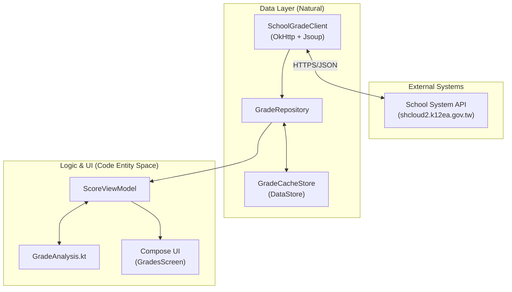

# CLHS Score Android — The Affiliated Zhongli Senior High School of National Central University

[![DeepWiki](https://img.shields.io/badge/DeepWiki-alvin000009238%2Fclhs__score-blue.svg?logo=data\:image/png;base64,iVBORw0KGgoAAAANSUhEUgAAACwAAAAyCAYAAAAnWDnqAAAAAXNSR0IArs4c6QAAA05JREFUaEPtmUtyEzEQhtWTQyQLHNak2AB7ZnyXZMEjXMGeK/AIi+QuHrMnbChYY7MIh8g01fJoopFb0uhhEqqcbWTp06/uv1saEDv4O3n3dV60RfP947Mm9/SQc0ICFQgzfc4CYZoTPAswgSJCCUJUnAAoRHOAUOcATwbmVLWdGoH//PB8mnKqScAhsD0kYP3j/Yt5LPQe2KvcXmGvRHcDnpxfL2zOYJ1mFwrryWTz0advv1Ut4CJgf5uhDuDj5eUcAUoahrdY/56ebRWeraTjMt/00Sh3UDtjgHtQNHwcRGOC98BJEAEymycmYcWwOprTgcB6VZ5JK5TAJ+fXGLBm3FDAmn6oPPjR4rKCAoJCal2eAiQp2x0vxTPB3ALO2CRkwmDy5WohzBDwSEFKRwPbknEggCPB/imwrycgxX2NzoMCHhPkDwqYMr9tRcP5qNrMZHkVnOjRMWwLCcr8ohBVb1OMjxLwGCvjTikrsBOiA6fNyCrm8V1rP93iVPpwaE+gO0SsWmPiXB+jikdf6SizrT5qKasx5j8ABbHpFTx+vFXp9EnYQmLx02h1QTTrl6eDqxLnGjporxl3NL3agEvXdT0WmEost648sQOYAeJS9Q7bfUVoMGnjo4AZdUMQku50McDcMWcBPvr0SzbTAFDfvJqwLzgxwATnCgnp4wDl6Aa+Ax283gghmj+vj7feE2KBBRMW3FzOpLOADl0Isb5587h/U4gGvkt5v60Z1VLG8BhYjbzRwyQZemwAd6cCR5/XFWLYZRIMpX39AR0tjaGGiGzLVyhse5C9RKC6ai42ppWPKiBagOvaYk8lO7DajerabOZP46Lby5wKjw1HCRx7p9sVMOWGzb/vA1hwiWc6jm3MvQDTogQkiqIhJV0nBQBTU+3okKCFDy9WwferkHjtxib7t3xIUQtHxnIwtx4mpg26/HfwVNVDb4oI9RHmx5WGelRVlrtiw43zboCLaxv46AZeB3IlTkwouebTr1y2NjSpHz68WNFjHvupy3q8TFn3Hos2IAk4Ju5dCo8B3wP7VPr/FGaKiG+T+v+TQqIrOqMTL1VdWV1DdmcbO8KXBz6esmYWYKPwDL5b5FA1a0hwapHiom0r/cKaoqr+27/XcrS5UwSMbQAAAABJRU5ErkJggg==)](https://deepwiki.com/alvin000009238/clhs_score)

> [!IMPORTANT]
> This project is an unofficial third-party service. We are not directly affiliated with CLHS or the ShinHer Smart Campus Platform.

This repository is centered on a native Android app built with Kotlin, Jetpack Compose, and Material 3. It provides grade lookup, analysis, trend comparison, and timetable widgets.

## Highlights

* **Native Android app**: Built with Kotlin, Jetpack Compose, and Material 3, with direct mobile-side access to the school system.
* **Grade visualization**: Radar charts, bar charts, five-standard placement, and score distributions for quickly understanding academic performance.
* **Dark mode and dynamic color**: Supports light mode, dark mode, AMOLED pure black mode, and Material You dynamic color.
* **Grade simulator**: Adjust subject scores and included subjects to quickly estimate the recalculated average.
* **Historical trend comparison**: Automatically compares the current exam with the previous one to track improvement or decline over time.

## Architecture Overview

## Project Structure

| Directory                                  | Description                                                        | Documentation                          |
| ------------------------------------------ | ------------------------------------------------------------------ | -------------------------------------- |
| [`android/`](android/)                     | Native Kotlin / Jetpack Compose app                                | [android/README.md](android/README.md) |
| [`demo/`](demo/)                           | Demo assets and screenshot pages                                   |                                        |
| [`.github/workflows/`](.github/workflows/) | Workflows for Android releases, demo deployment, and code scanning |                                        |

## Quick Start

See [`android/README.md`](android/README.md) for instructions on building and testing the Android app with Gradle.

## Contributor

[@alvin000009238](https://github.com/alvin000009238)

## License

[MIT](LICENSE) © 2026 alvin000009238
