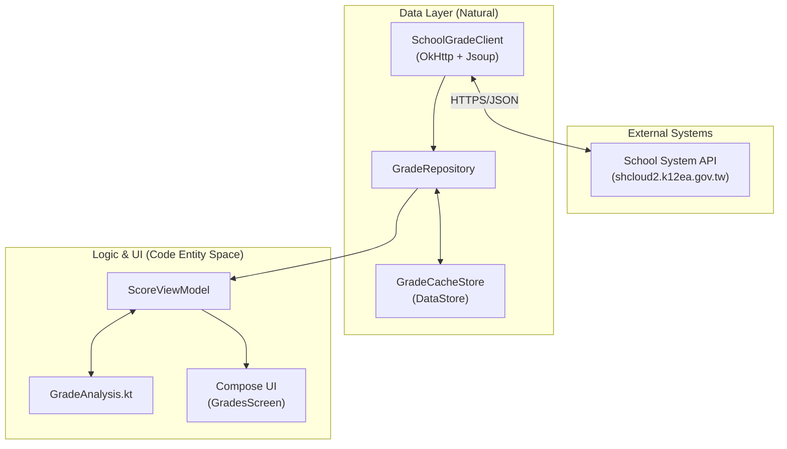

# CLHS Score Android — The Affiliated Zhongli Senior High School of National Central University

> [!IMPORTANT]
> This project is an unofficial third-party service. We are not directly affiliated with CLHS or the ShinHer Smart Campus Platform.

This repository is centered on a native Android app built with Kotlin, Jetpack Compose, and Material 3. It provides grade lookup, analysis, trend comparison, and timetable widgets.

## Highlights

* **Native Android app**: Built with Kotlin, Jetpack Compose, and Material 3, with direct mobile-side access to the school system.
* **Grade visualization**: Radar charts, bar charts, five-standard placement, and score distributions for quickly understanding academic performance.
* **Dark mode and dynamic color**: Supports light mode, dark mode, AMOLED pure black mode, and Material You dynamic color.
* **Grade simulator**: Adjust subject scores and included subjects to quickly estimate the recalculated average.
* **Historical trend comparison**: Automatically compares the current exam with the previous one to track improvement or decline over time.

## Architecture Overview

## Project Structure

| Directory                                  | Description                                                        | Documentation                          |
| ------------------------------------------ | ------------------------------------------------------------------ | -------------------------------------- |
| [`android/`](android/)                     | Native Kotlin / Jetpack Compose app                                | [android/README.md](android/README.md) |
| [`demo/`](demo/)                           | Demo assets and screenshot pages                                   |                                        |
| [`.github/workflows/`](.github/workflows/) | Workflows for Android releases, demo deployment, and code scanning |                                        |

## Quick Start

See [`android/README.md`](android/README.md) for instructions on building and testing the Android app with Gradle.

## Contributor

[@alvin000009238](https://github.com/alvin000009238)

## License

[MIT](LICENSE) © 2026 alvin000009238
