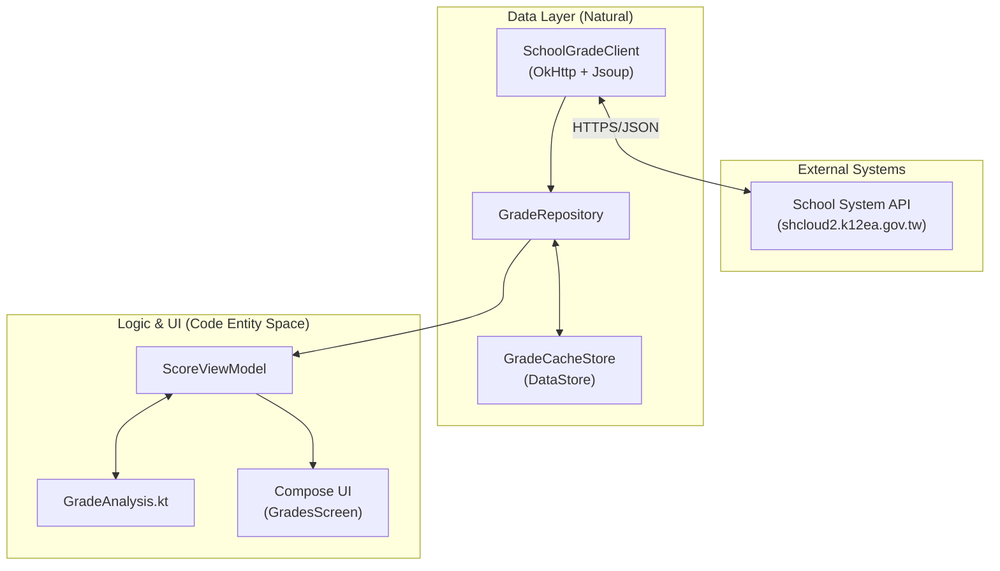

# 壢中成績 Android — 中大壢中

[![DeepWiki](https://img.shields.io/badge/DeepWiki-alvin000009238%2Fclhs__score-blue.svg?logo=data:image/png;base64,iVBORw0KGgoAAAANSUhEUgAAACwAAAAyCAYAAAAnWDnqAAAAAXNSR0IArs4c6QAAA05JREFUaEPtmUtyEzEQhtWTQyQLHNak2AB7ZnyXZMEjXMGeK/AIi+QuHrMnbChYY7MIh8g01fJoopFb0uhhEqqcbWTp06/uv1saEDv4O3n3dV60RfP947Mm9/SQc0ICFQgzfc4CYZoTPAswgSJCCUJUnAAoRHOAUOcATwbmVLWdGoH//PB8mnKqScAhsD0kYP3j/Yt5LPQe2KvcXmGvRHcDnpxfL2zOYJ1mFwrryWTz0advv1Ut4CJgf5uhDuDj5eUcAUoahrdY/56ebRWeraTjMt/00Sh3UDtjgHtQNHwcRGOC98BJEAEymycmYcWwOprTgcB6VZ5JK5TAJ+fXGLBm3FDAmn6oPPjR4rKCAoJCal2eAiQp2x0vxTPB3ALO2CRkwmDy5WohzBDwSEFKRwPbknEggCPB/imwrycgxX2NzoMCHhPkDwqYMr9tRcP5qNrMZHkVnOjRMWwLCcr8ohBVb1OMjxLwGCvjTikrsBOiA6fNyCrm8V1rP93iVPpwaE+gO0SsWmPiXB+jikdf6SizrT5qKasx5j8ABbHpFTx+vFXp9EnYQmLx02h1QTTrl6eDqxLnGjporxl3NL3agEvXdT0WmEost648sQOYAeJS9Q7bfUVoMGnjo4AZdUMQku50McDcMWcBPvr0SzbTAFDfvJqwLzgxwATnCgnp4wDl6Aa+Ax283gghmj+vj7feE2KBBRMW3FzOpLOADl0Isb5587h/U4gGvkt5v60Z1VLG8BhYjbzRwyQZemwAd6cCR5/XFWLYZRIMpX39AR0tjaGGiGzLVyhse5C9RKC6ai42ppWPKiBagOvaYk8lO7DajerabOZP46Lby5wKjw1HCRx7p9sVMOWGzb/vA1hwiWc6jm3MvQDTogQkiqIhJV0nBQBTU+3okKCFDy9WwferkHjtxib7t3xIUQtHxnIwtx4mpg26/HfwVNVDb4oI9RHmx5WGelRVlrtiw43zboCLaxv46AZeB3IlTkwouebTr1y2NjSpHz68WNFjHvupy3q8TFn3Hos2IAk4Ju5dCo8B3wP7VPr/FGaKiG+T+v+TQqIrOqMTL1VdWV1DdmcbO8KXBz6esmYWYKPwDL5b5FA1a0hwapHiom0r/cKaoqr+27/XcrS5UwSMbQAAAABJRU5ErkJggg==)](https://deepwiki.com/alvin000009238/clhs_score)

> [!IMPORTANT]
> 本專案為非官方開發之第三方服務，我們與壢中及欣河智慧校園平台無任何直接關聯。

此 repo 以 Android 原生 app 為核心，使用 Kotlin、Jetpack Compose 與 Material 3 實作成績查詢、分析、趨勢比較與課表小工具。

## 功能亮點

- **Android 原生版**：Kotlin + Jetpack Compose + Material 3，手機端直接連線學校系統。
- **成績視覺化**：雷達圖、長條圖、五標落點、分數分布，一眼掌握表現。
- **深色模式與動態色彩**：支援淺色、深色、AMOLED 純黑與 Material You 動態色彩。
- **成績模擬器**：調整各科分數與採計科目，快速試算調整後的平均。
- **歷次趨勢比較**：自動對比前次考試，追蹤進退步軌跡。

## 架構總覽

## 專案結構

| 目錄 | 說明 | 文件 |
|------|------|------|
| [`android/`](android/) | Kotlin / Jetpack Compose 原生 App | [android/README.md](android/README.md) |
| [`demo/`](demo/) | 展示素材與截圖頁面 | |
| [`.github/workflows/`](.github/workflows/) | Android release、demo deploy 與程式碼掃描 workflow | |

## 快速開始

參見 [`android/README.md`](android/README.md)，使用 Gradle 建置與測試 Android app。

## 貢獻者

[@alvin000009238](https://github.com/alvin000009238)

## License

[MIT](LICENSE) © 2026 alvin000009238
