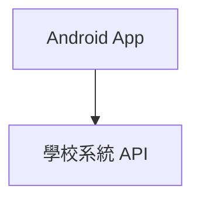

# 壢中成績 Web Android — 中大壢中

> [!IMPORTANT]
> 本專案為非官方開發之第三方服務，我們與壢中及欣河智慧校園平台無任何直接關聯。

此 repo 目前保留 Android 原生版與相關文件。原 Flask/Vite Web 端已搬到同層 `../clhs-score-worker/web`，Cloudflare Worker 版已搬到同層 `../clhs-score-worker`。

## 功能亮點

- **Android 原生版**：Kotlin + Jetpack Compose + Material 3，手機直連學校系統，不依賴 Web 伺服器。
- **成績視覺化**：雷達圖、長條圖、五標落點、分數分布，一眼掌握表現。
- **深色模式與動態色彩**：支援淺色、深色、AMOLED 純黑與 Material You 動態色彩。
- **成績模擬器**：調整各科分數與採計科目，快速試算調整後的平均。
- **歷次趨勢比較**：自動對比前次考試，追蹤進退步軌跡。

## 架構總覽

## 專案結構

| 目錄 | 說明 | 文件 |
|------|------|------|
| [`android/`](android/) | Kotlin / Jetpack Compose 原生 App | [android/README.md](android/README.md) |
| [`docs/`](docs/) | 架構文件 | [docs/](docs/) |
| [`demo/`](demo/) | Demo 相關內容 | |

## 同層拆分專案

| 目錄 | 說明 |
|------|------|
| [`../clhs-score-worker/web`](../clhs-score-worker/web) | Flask 後端 + Vite 前端 + Docker 部署 |
| [`../clhs-score-worker`](../clhs-score-worker) | Cloudflare Workers fullstack web backend |

## 快速開始

- **Android**：參見 [`android/README.md`](android/README.md)，使用 Gradle 建置。
- **Web**：切到 `../clhs-score-worker/web` 後參考該目錄的 `README.md`。
- **Cloudflare Worker**：切到 `../clhs-score-worker` 後參考該目錄的 `README.md`。

## 貢獻者

[@alvin000009238](https://github.com/alvin000009238)

## License

[MIT](LICENSE) © 2026 alvin000009238