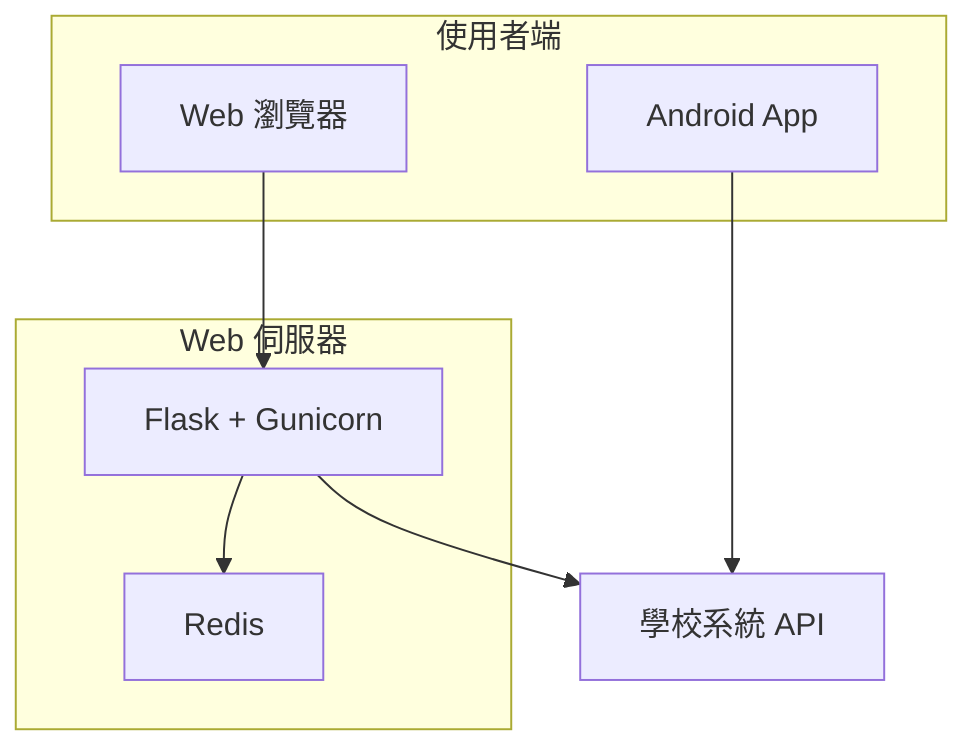

# 成績分析平台 — 中大壢中

> [!IMPORTANT]
> 本專案為非官方開發之第三方服務，我們與壢中及欣河智慧校園平台無任何直接關聯。

自動化的成績查詢與分析系統，全程透過原生 HTTP 請求與學校系統 API 介接，免去開啟瀏覽器的負擔。提供快速、輕量的查詢體驗，並支援成績分享連結。

## 功能亮點

- 🔐 **一鍵登入** — 自動處理驗證流程，輸入帳密即可查詢
- 📊 **成績視覺化** — 雷達圖、長條圖、五標落點、分數分布，一眼掌握表現
- 📱 **Android 原生版** — Kotlin + Jetpack Compose + Material 3，手機直連學校系統，不依賴 Web 伺服器
- 🌙 **深色模式 & 動態色彩** — Android 版支援淺色 / 深色 / AMOLED 純黑 / Material You 動態色彩
- 🎯 **成績模擬器** — 調整各科分數與採計科目，快速試算調整後的平均
- 📈 **歷次趨勢比較** — 自動對比前次考試，追蹤進退步軌跡

## 架構總覽

## 專案結構

| 目錄 | 說明 | 文件 |
|------|------|------|
| [`web/`](web/) | Flask 後端 + Vite 前端 + Docker 部署 | [web/README.md](web/README.md) |
| [`android/`](android/) | Kotlin / Jetpack Compose 原生 App | [android/README.md](android/README.md) |
| [`docs/`](docs/) | 架構文件 | [ARCHITECTURE.md](docs/ARCHITECTURE.md) |

## 快速開始

請依照各子專案的 README 進行設定：

- **Web 端**：參見 [`web/README.md`](web/README.md)，使用 Docker Compose 一鍵啟動
- **Android**：參見 [`android/README.md`](android/README.md)，使用 Gradle 建置

## 貢獻者

[@alvin000009238](https://github.com/alvin000009238)

## License

[MIT](LICENSE) © 2026 alvin000009238
